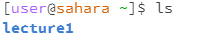
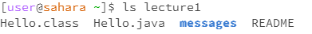
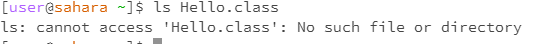

Image 1 is CD with no Arguement

Image 2 is CD with Directory

Image 3 is CD with File

Image 4 is ls with no Arguement

Image 5 is ls with Directory

Image 6 is ls with file

Image 7 is cat with no Arguement

Image 8 is cat with Directory

Image 9 is cat with file
